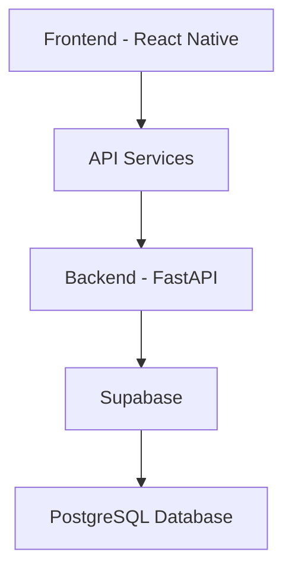
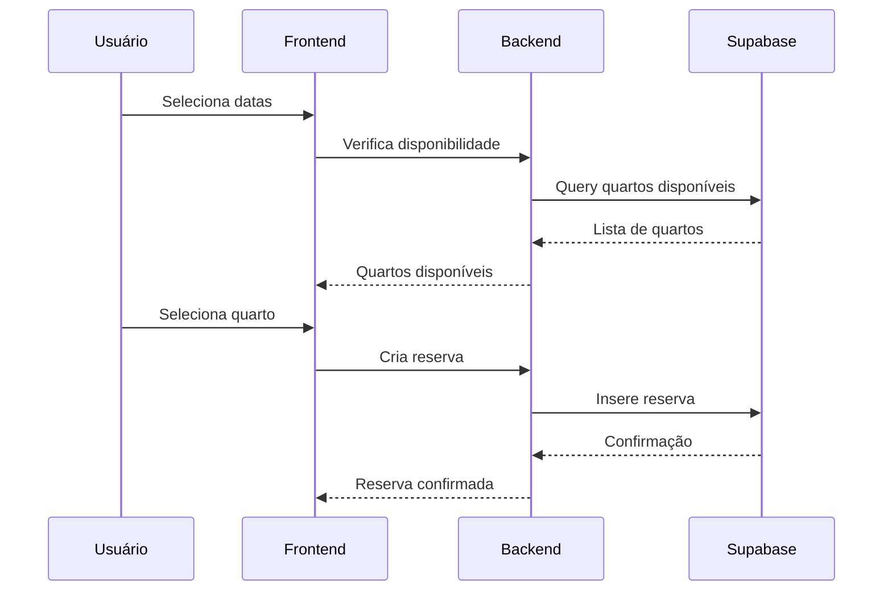
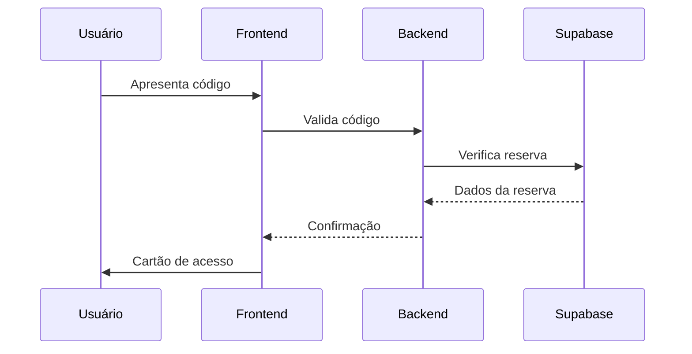
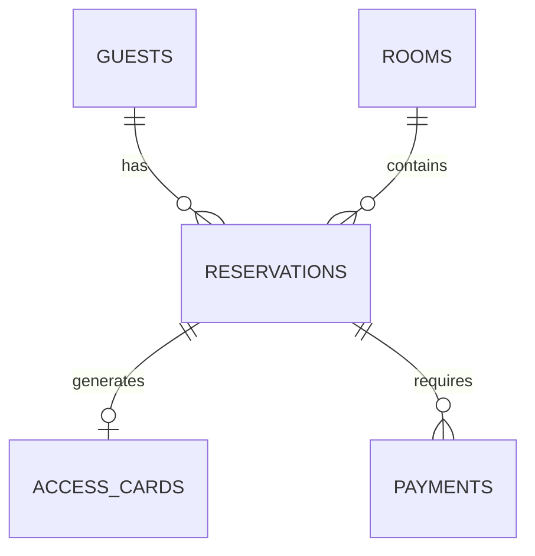

# Estrutura do Projeto Hotel Management System

## Arquitetura Geral



## Estrutura de Diretórios

```
hotel-management-system/
├── src/                      # Código fonte principal
│   ├── components/           # Componentes React reutilizáveis
│   ├── config/              # Configurações do projeto
│   ├── context/             # Contextos React (Auth, Theme, etc)
│   ├── hooks/               # Hooks personalizados
│   ├── navigation/          # Configuração de rotas
│   ├── screens/             # Telas do aplicativo
│   │   ├── Reservar/       # Tela de reservas
│   │   ├── access/         # Controle de acesso
│   │   ├── checkin/        # Check-in/out
│   │   ├── dashboard/      # Painel principal
│   │   ├── explore/        # Explorar quartos
│   │   ├── menu/          # Menu principal
│   │   ├── payments/      # Pagamentos
│   │   ├── profile/       # Perfil do usuário
│   │   ├── reservations/  # Gerenciamento de reservas
│   │   ├── roomservice/   # Serviço de quarto
│   │   └── shop/         # Loja/Serviços extras
│   ├── services/          # Serviços de API
│   │   ├── ReservationService.ts
│   │   ├── SyncService.ts
│   │   └── api.ts
│   └── utils/             # Funções utilitárias
├── backend/               # Backend FastAPI
│   ├── app/              # Código fonte do backend
│   ├── alembic/          # Migrações do banco
│   └── tests/            # Testes do backend
└── supabase/             # Configuração Supabase
    ├── migrations/       # Migrações do banco
    └── seed.sql         # Dados iniciais

```

## Fluxo de Dados

### Reservas


### Check-in


## Banco de Dados

### Tabelas Principais
- rooms (Quartos)
- guests (Hóspedes)
- reservations (Reservas)
- access_cards (Cartões de Acesso)
- payments (Pagamentos)

### Relacionamentos


## Serviços API

### ReservationService
- Criação de reservas
- Consulta de disponibilidade
- Gerenciamento de check-in/out
- Geração de cartões de acesso

### SyncService
- Sincronização de dados offline
- Cache de informações
- Gestão de conflitos

### API Principal
- Autenticação
- CRUD de entidades
- Integração com Supabase
