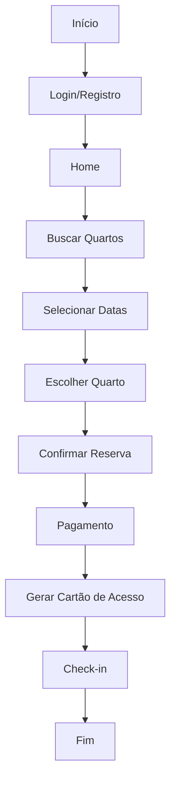

# Fluxograma do Sistema de Reservas de Hotel

## Fluxo do Usuário

## Componentes do Sistema

### Frontend (React Native)
- Telas:
  - Home
  - Reservar
  - Cartões
  - Conta
  - Menu

### Backend (FastAPI)
- APIs:
  - Autenticação
  - Reservas
  - Quartos
  - Cartões de Acesso
  - Pagamentos

### Banco de Dados (PostgreSQL)
- Tabelas:
  - Users
  - Rooms
  - Reservations
  - Access_Cards
  - Payments

## Fluxo de Dados

1. **Registro/Login**
   - Frontend envia credenciais
   - Backend valida e retorna token JWT
   - Token é armazenado no AsyncStorage

2. **Busca de Quartos**
   - Frontend envia parâmetros de busca
   - Backend consulta disponibilidade
   - Retorna lista de quartos disponíveis

3. **Reserva**
   - Frontend envia dados da reserva
   - Backend valida disponibilidade
   - Cria reserva no banco
   - Gera cartão de acesso

4. **Cartão de Acesso**
   - Backend gera QR Code único
   - Frontend exibe cartão
   - QR Code contém dados criptografados

## Segurança

- Autenticação JWT
- Criptografia de senhas com bcrypt
- HTTPS para todas as requisições
- Validação de dados em ambos os lados
- Proteção contra SQL Injection
